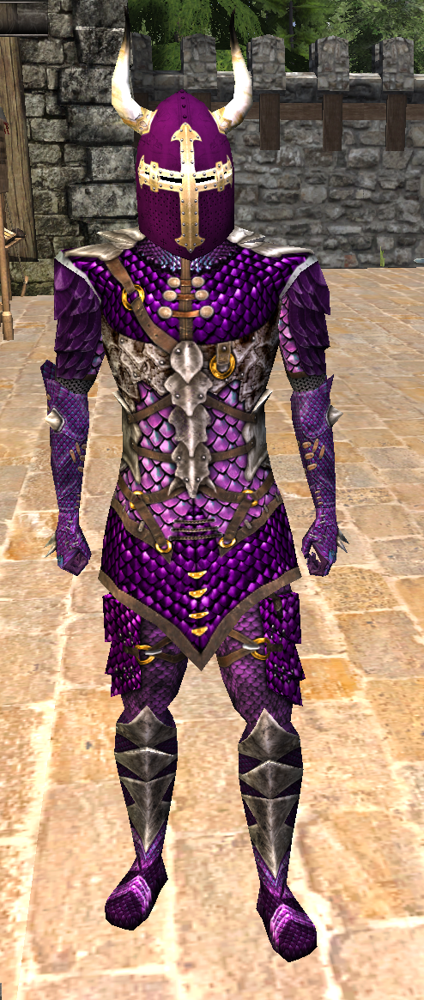

# WyvernMods
This is a fork of the [wyvernmods](https://github.com/Sindusk/wyvernmods) mod. Possibly edited to be better.

NOTE THAT AS OF ty3.1 YOU **HAVE TO** MANAGE YOUR PROPERTIES FILE WHEN UPDATING THE MOD! Inside it explains what you have to do to easily keep your old configuration.

This fork optionally uses serverpacks and my [Iconzz mod](https://gitlab.com/tyoda-wurm/Iconzz). If you don't have them installed/working, you may just disable options that say they require them, and wyvernmods should work fine.

Changes include:
- (Major changes)
 - Fixed some early loading of classes, increasing compatibility with other mods
 - Removed nasty errors when you have wyverns disabled, but it tries to use their template IDs (though this 'fix' could be improved upon)
 - Added glimmerscale armor models made by **kalxen**. (see image below) (Optional. Serverpacks mod required)
 - Added custom icons for knuckles, glimmerscale set (Optional. [Iconzz mod](https://gitlab.com/tyoda-wurm/Iconzz) required)
 - (Minor changes)
 - Fixed a few infinite loops (although since they've never been a problem, they probably wouldn't be problematic anyway)
 - Fixed typos

The new glimmerscale armor models, **made by kalxen**:

If you want to look over my commits, don't sweat over the refactor/cleanup type of stuff, they are ultimately
inconsequential to the mod (except for typo fixes I guess). The specially named commits have the good stuff in them.
